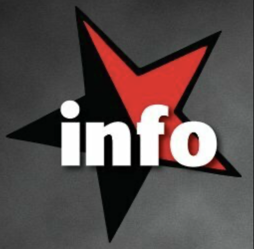

<div align="center">
  
</div>

<h1 align="center">InfoLibertaire</h1>

<p align="center">
  🏴 Un client de bureau moderne pour <a href="https://InfoLibertaire.net">InfoLibertaire.net</a>
</p>

<p align="center">
  <a href="#installation">
    
  </a>
  <a href="https://github.com/electron/electron">
    
  </a>
  
</p>

## ✨ Fonctionnalités

- 🔄 **Actualisation Rapide** - Rechargement instantané des articles
- ⭐ **Gestion des Favoris** - Sauvegardez vos articles préférés
- 📱 **Interface Moderne** - Design épuré et réactif
- 📤 **Partage Facile** - Partagez les articles en un clic
- 🎯 **Navigation Fluide** - Accès direct aux contenus

## 🚀 Installation

### Option 1: Installation avec .deb (Debian/Ubuntu)
```bash
sudo dpkg -i infolibertaire_1.0.0_amd64.deb
```

### Option 2: Utilisation de l'AppImage
```bash
chmod +x InfoLibertaire-1.0.0.AppImage
./InfoLibertaire-1.0.0.AppImage
```

## 🪟 Version Windows

Une version Windows est disponible :
- Installeur (.exe, NSIS) pour une installation permanente
- Version portable (.exe) sans installation

Consultez le fichier [README_windows.md](README_windows.md) pour les instructions détaillées d'installation et d'utilisation sur Windows.

## 💻 Développement

Pour lancer l'application en mode développement :

```bash
# Installation des dépendances
npm install

# Lancement de l'application
npm start
```

## 🛠️ Construction

Pour construire l'application :

```bash
# Construction des paquets .deb et AppImage
npm run dist
```

## 📦 Technologies

- [Electron](https://www.electronjs.org/) - Framework d'application de bureau
- HTML5/CSS3/JavaScript - Technologies web standard
- LocalStorage - Stockage local des favoris

## 📝 Licence

Ce projet est sous licence GNU GPL v3 - voir le fichier [LICENSE](LICENSE) pour plus de détails.

Cette licence garantit vos libertés fondamentales :
- ✅ Liberté d'exécuter le programme
- ✅ Liberté d'étudier le code source
- ✅ Liberté de redistribuer des copies
- ✅ Liberté de modifier et distribuer vos modifications

---

<p align="center">
  Fait avec ❤️ pour la commu infolibertaire
</p>
